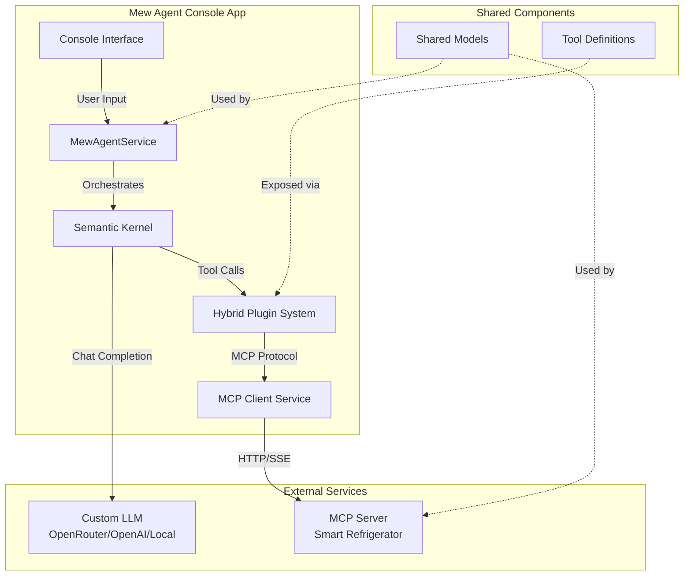
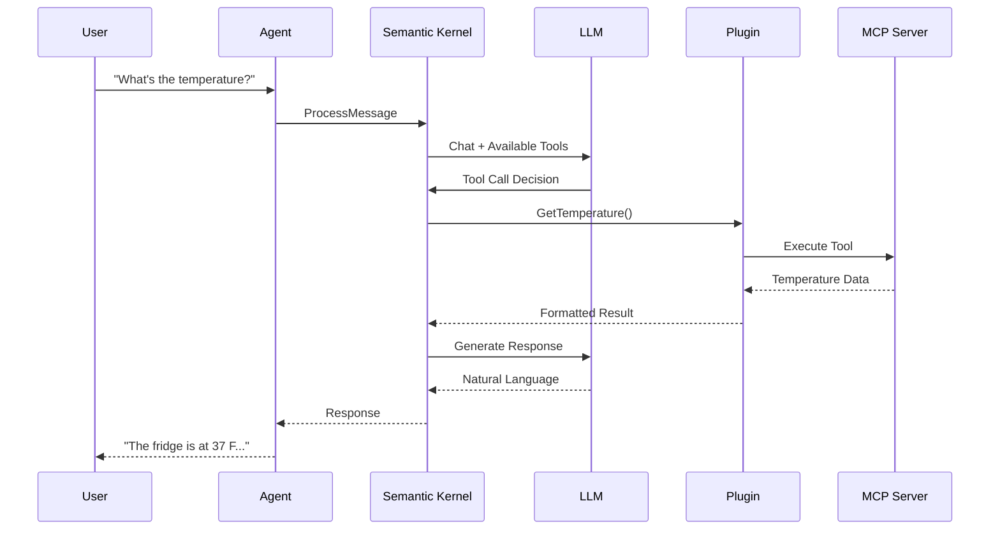

# Mew Agent Architecture Documentation

## Table of Contents
- [Overview](#overview)
- [System Architecture](#system-architecture)
- [Component Breakdown](#component-breakdown)
- [Data Flow](#data-flow)
- [Key Design Patterns](#key-design-patterns)
- [Technology Stack](#technology-stack)
- [Code Organization](#code-organization)

## Overview

Mew Agent is a smart home AI assistant that demonstrates proper Model Context Protocol (MCP) integration with Microsoft Semantic Kernel. The system uses real MCP server communication and supports any OpenAI-compatible LLM endpoint.

### Core Concepts
- **Semantic Kernel (SK)**: Microsoft's AI orchestration framework
- **MCP (Model Context Protocol)**: Standardized protocol for AI tool integration
- **Plugin Architecture**: Modular tool system for extensibility
- **OpenAI Compatibility**: Works with any LLM that follows OpenAI's API format

## System Architecture



## Component Breakdown

### 1. **MewAgentService** (`Services/MewAgentService.cs`)
The brain of the application that orchestrates all interactions.

**Responsibilities:**
- Initializes Semantic Kernel with custom LLM configuration
- Manages conversation history using SK's ChatHistory
- Processes user messages with automatic tool calling
- Handles plugin registration and lifecycle

**Key Features:**
- Custom endpoint support for any OpenAI-compatible API
- Configurable model parameters (temperature, max tokens)
- System prompt management for agent personality
- Error handling and logging

### 2. **McpClientService** (`Services/McpClientService.cs`)
Manages MCP protocol connections and plugin creation.

**Responsibilities:**
- Discovers available tools from MCP server via HTTP
- Creates Kernel plugins from discovered MCP tools
- Executes tool calls via MCP server API
- Handles serialization and error management

**Protocol Support:**
- HTTP transport for MCP communication
- Dynamic tool discovery at runtime
- JSON serialization for complex results

### 3. **MCP Server** (`McpServerRefrigerator/`)
Provides refrigerator functionality as MCP-compliant tools.

**Available Tools via MCP:**
- `GetTemperature` - Check fridge/freezer temperatures
- `SetTemperature` - Adjust temperature settings  
- `GetDiagnostics` - System health monitoring
- `GetInventory` - Food inventory tracking
- `GetRecipeSuggestions` - AI-powered recipe suggestions

Tools are exposed via HTTP endpoints and discovered dynamically.

### 4. **RefrigeratorService** (`Services/RefrigeratorService.cs`)
Business logic layer for smart refrigerator operations.

**Features:**
- Temperature management with validation
- System diagnostics and health monitoring
- Food inventory tracking with expiration dates
- Recipe suggestions based on available ingredients
- Realistic delays and 10% failure simulation for testing

## Data Flow

### User Interaction Flow
```
1. User Input → Console Interface
2. Console → MewAgentService.ProcessMessageAsync()
3. MewAgentService → Semantic Kernel
4. SK → LLM for intent understanding
5. LLM identifies tool needs → SK Tool Calling
6. SK → RefrigeratorPlugin function
7. Plugin → MCP Client → MCP Server
8. Response flows back through the chain
9. Final response → User
```

### Tool Calling Sequence


## Key Design Patterns

### 1. **Dependency Injection**
All services are registered via Microsoft.Extensions.DependencyInjection for testability and modularity.

```csharp
services.AddSingleton<MewAgentService>();
services.AddSingleton<HybridMcpService>();
services.AddHttpClient<McpClientService>();
```

### 2. **Plugin Architecture**
Tools are exposed as plugins using Semantic Kernel's plugin system:
- Automatic discovery via `[KernelFunction]` attributes
- Dynamic loading at runtime
- Strongly-typed parameters with descriptions

### 3. **Builder Pattern**
Kernel construction uses fluent builder pattern:
```csharp
var kernel = Kernel.CreateBuilder()
    .AddOpenAIChatCompletion(modelId, apiKey, httpClient)
    .Build();
```

### 4. **Async/Await Throughout**
All I/O operations are async for optimal performance:
- LLM API calls
- MCP tool execution
- Network communication

## Technology Stack

### Core Technologies
| Component | Technology | Version | Purpose |
|-----------|------------|---------|---------|
| Runtime | .NET | 8.0 | Application runtime |
| AI Orchestration | Semantic Kernel | 1.x | AI workflow management |
| MCP Client | mcpdotnet | 1.2.0.1 | MCP protocol support |
| DI Container | Microsoft.Extensions.Hosting | 8.0 | Service management |
| HTTP Client | Microsoft.Extensions.Http | 8.0 | Network communication |
| Configuration | Microsoft.Extensions.Configuration | 8.0 | Settings management |

### LLM Support
- **OpenAI**: GPT-3.5, GPT-4, GPT-4 Turbo
- **OpenRouter**: Any model on their platform
- **Local LLMs**: Ollama, LocalAI, LM Studio
- **Custom**: Any OpenAI-compatible endpoint

## Code Organization

```
/mew-agent/
├── MewAgent/                      # Console Application
│   ├── Program.cs                 # Entry point & DI setup
│   ├── Services/
│   │   ├── MewAgentService.cs    # Main orchestration
│   │   ├── HybridMcpService.cs   # MCP connection management
│   │   └── McpClientService.cs   # HTTP fallback client
│   ├── Plugins/
│   │   └── RefrigeratorPlugin.cs # Tool implementations
│   └── appsettings.json          # Configuration
│
├── McpServerRefrigerator/        # Mock MCP Server
│   ├── Controllers/
│   │   └── McpController.cs      # API endpoints
│   ├── Services/
│   │   ├── RefrigeratorService.cs # Business logic
│   │   └── ToolExecutionService.cs # Tool routing
│   └── Program.cs                # Server setup
│
└── Shared/                       # Common Components
    ├── McpModels.cs              # MCP protocol models
    └── RefrigeratorModels.cs    # Domain models
```

## Configuration

### appsettings.json Structure
```json
{
  "OpenAI": {
    "ApiKey": "your-api-key",
    "ModelId": "model-name",
    "Endpoint": "https://custom-endpoint/v1"  // Optional
  },
  "McpServer": {
    "BaseUrl": "http://localhost:5100",
    "Timeout": 30
  },
  "Agent": {
    "MaxTokens": 4000,
    "Temperature": 0.7,
    "SessionTimeoutMinutes": 120,
    "EnableDebugCommands": true
  }
}
```

## Extension Points

### Adding New Tools
1. Add method to `RefrigeratorPlugin.cs` with `[KernelFunction]` attribute
2. Implement tool logic in `RefrigeratorService.cs`
3. Add tool definition to MCP discovery endpoint
4. Tool automatically available to agent

### Supporting New LLMs
Just update `appsettings.json`:
- Set `Endpoint` to LLM's OpenAI-compatible API
- Set `ModelId` to desired model
- Provide appropriate `ApiKey`

### Adding New Device Types
1. Create new plugin class in `Plugins/`
2. Implement device-specific functions
3. Register plugin in `MewAgentService.InitializeAsync()`
4. Create corresponding MCP server if needed

## Performance Considerations

- **Memory Management**: ChatHistory is kept in memory (consider persistence for production)
- **Token Limits**: Configurable MaxTokens prevents excessive API costs
- **Connection Pooling**: HttpClient is reused via DI
- **Async Operations**: Non-blocking I/O for better scalability
- **Error Resilience**: Graceful fallbacks and error handling

## Security Notes

- **API Keys**: Store in environment variables or secure vaults (not in source)
- **Input Validation**: SK handles prompt injection protection
- **Network Security**: HTTPS recommended for production
- **Tool Authorization**: Consider adding auth to MCP server

## Learning Resources

- [Semantic Kernel Docs](https://learn.microsoft.com/semantic-kernel/)
- [MCP Protocol Spec](https://modelcontextprotocol.io/)
- [OpenAI API Reference](https://platform.openai.com/docs/)
- [Dependency Injection in .NET](https://learn.microsoft.com/en-us/dotnet/core/extensions/dependency-injection)

---

*This architecture is designed for learning and can be scaled for production with additional considerations for persistence, security, and monitoring.*